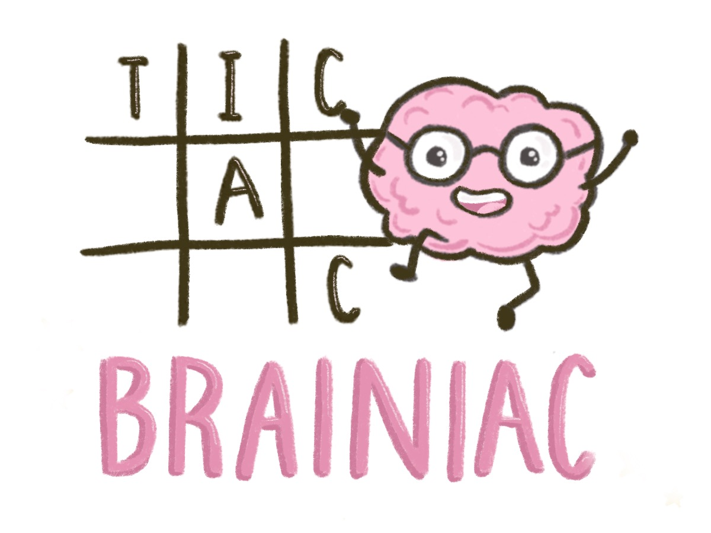
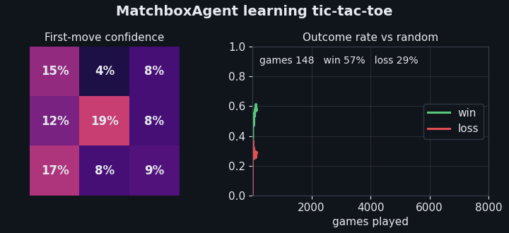
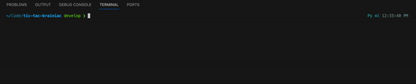
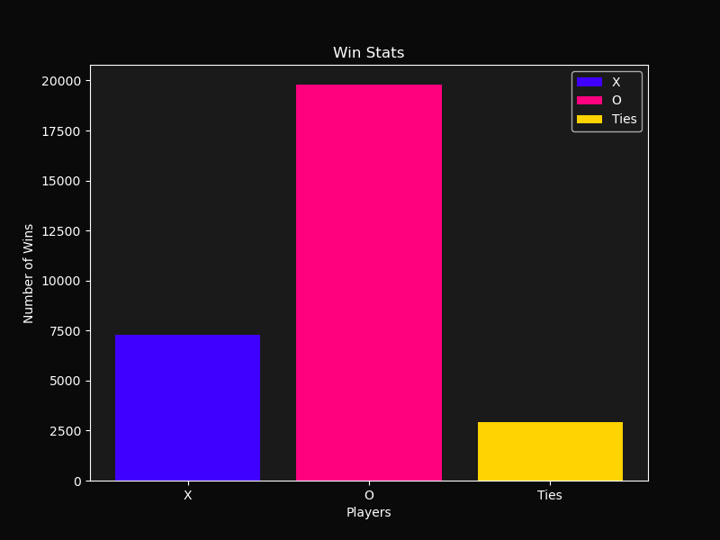
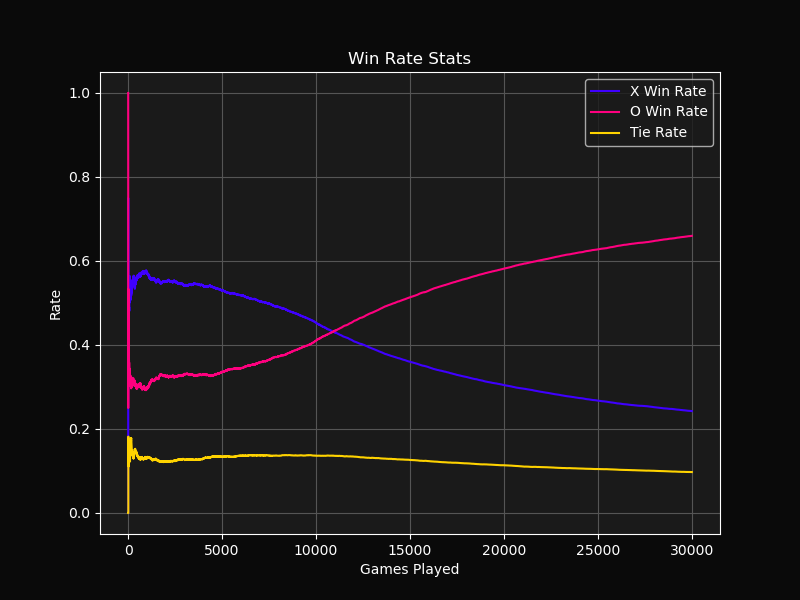
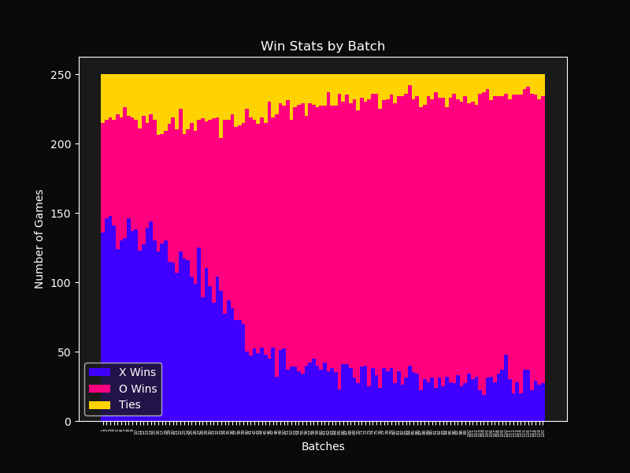
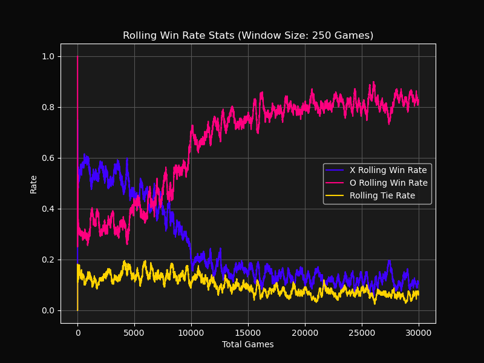
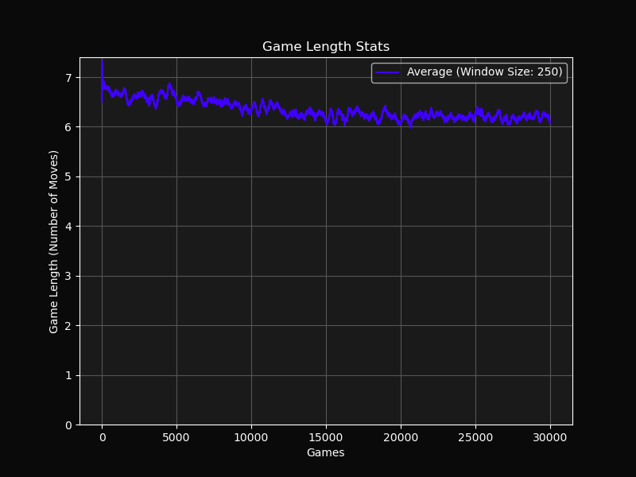
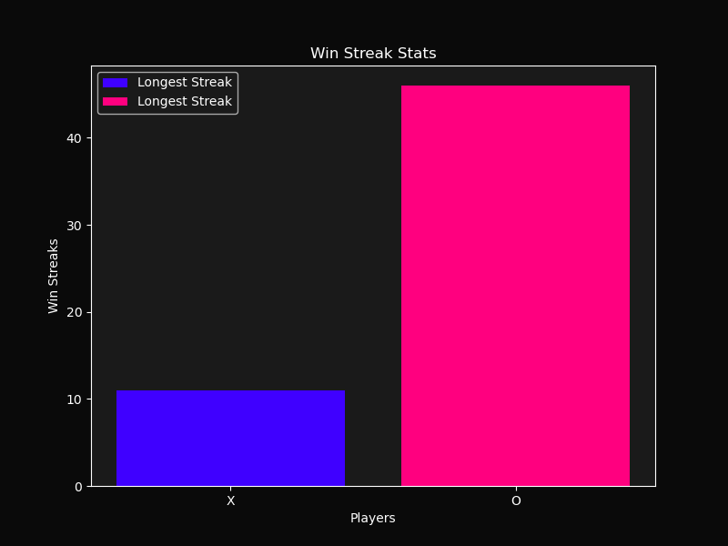
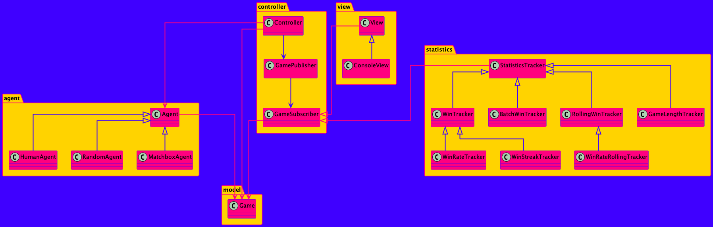

# Tic Tac Brainiac

Tic Tac Brainiac is an agent-based Tic Tac Toe game where various types of agents compete against each other across multiple rounds. After the rounds are complete, the game presents comprehensive statistics about the outcomes.

## Watch it learn



The MatchboxAgent starts with no preference and learns by MENACE-style tabular updates ([matchbox-rl](https://github.com/tctibbs/matchbox-rl)). On the left, its first-move confidence (the bead counts for the empty board) sharpens from near-uniform onto a strong opening. On the right, its rolling win and loss rates against a random opponent pull apart. These are real snapshots from one 8000-game run, sped up; every value shown is measured.

Regenerate with `uv run python tools/generate_demo.py`.

## Agent Types

- **RandomAgent**: Makes moves randomly.
- **MatchboxAgent**: Employs matchbox learning to evolve its strategy.
- **HumanAgent**: Relies on user input for its moves.

## Tic Tac Brainiac CLI

Configure and play Tic-Tac-Toe games using the Command Line Interface (CLI) with the following options:

- `--games`: Specifies the number of games to play.
- `--player1 {human, ai, random}`: Sets the agent type for Player 1 (default: `random`).
- `--player2 {human, ai, random}`: Sets the agent type for Player 2 (default: `ai`).
- `--board-size`: Determines the size of the game board (default: `3`).

### Example Usage

```bash
python main.py --games 10000 --player1 random --player2 ai
```



## Example Statistics 

Statistics with X as Random Agent, O as Matchbox Agent.

|  |  |  |
| --- | --- | --- |
|  |  |  |


## Architecture Diagram


